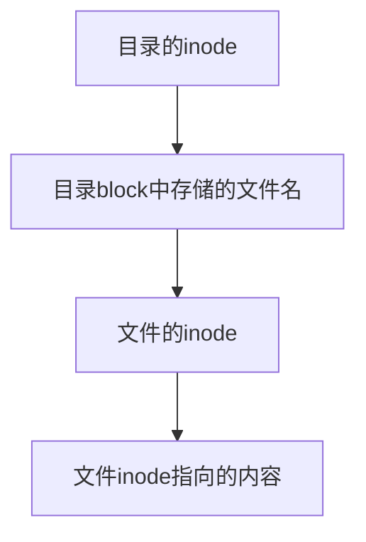

# EXT2档案系统

- 由于Linux是一个多人多任务环境，所以会具有多样化的档案属性
- 在EXT2档案系统中，将档案的内容分成两部分存储，一部分是档案的属性，另一部分是档案的内容
- [[Linux_file_inode]]存储档案的属性
- Block存储档案的内容
- 目录
  - inode记录相关属性
  - block记录该目录下相关的文件或目录
- 文件：
  - 至少分配一个inode
  - 根据文件大小分配block
- 操作系统取得文件数据的过程  
  
